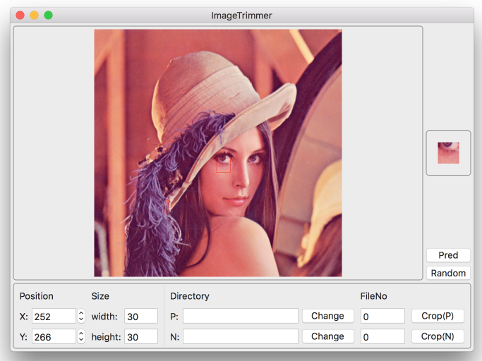
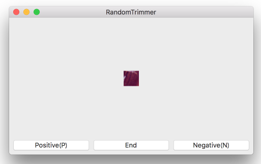

# ImageTrimmer
Image trimming tool for Machine Learning.

For trimming numerous, fixed size images from one image.

Xcode8/Swift3/OSX

Currently, it's specialized for binary classification.

# Usage
## Trim manually

1. Drag and drop image in the upper box.
1. Set output directories and file numbers(they will increment automatically).
1. Set width and height.
1. Set x and y(Input value, or just click image).
1. Trimming preview will be shown on the right box.
1. Press "Crop(P)" or "Crop(N)" button to trim and save positive/negative image.

Can zoom, scroll.

## Trim randomly

1. Drag and drop image in upper box of main window.
1. Set output directory and start file number.
1. Set width and height.
1. Press "Random" button, then new window will open.
1. Randomly trimmed image will be shown, Press "Positive"/"Negative" button to save image.
